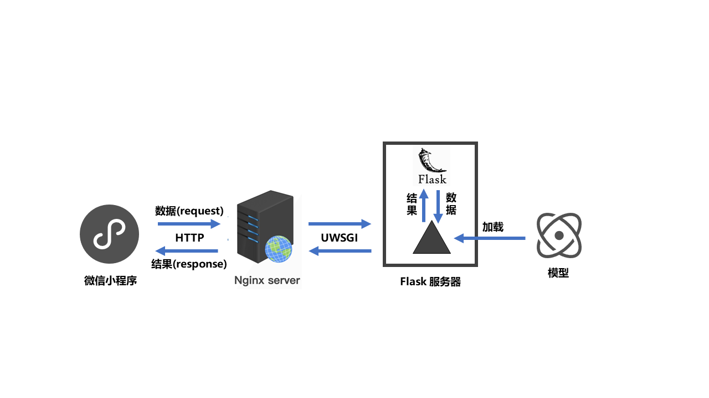

# Image-Caption-Application
## 介绍
  Image Caption是一个综合而具有挑战性的工作，我们基于实践课上所学知识的想法，选择了encoder-decoder加上attention机制的方式，分别使用 COCO 2014 英文caption数据集和 AI Challenger 2017 的中文caption数据集，基于PyTorch，复现并训练出了Kelvin Xu等人的论文[ Show, Attend, and Tell ](https://arxiv.org/abs/1502.03044)里的模型，然后将其部署在服务器上，并开发了配套的小程序作为一个image caption的应用，实现了不错的相应速度和结果。
 <div  align="center">    
  
 </div>


## MODEL 模型部分
### 数据预处理
  我们首先遍历数据集，对英文数据集直接分词，或对中文数据集调用结巴分词进行分词预处理，统计词频，制作词汇表，生成一个`WORDMAP.json`文件，同时划分出训练集、验证集与测试集，方便接下来直接读取该json文件来训练我们的模型。
  我们只需要下载好相关数据集后，并在`create_input_files.py`文件中设置好相关参数，运行下列代码即可自动生成WORDMAP文件，使用`-l`或`--language`来指定中英文，默认是英文：
```python3
python create_input_files.py -l="chinese"
```

### 训练模型
  在`train.py`文件中开头中设置好相关参数，直接运行下列代码即可开始训练模型：
```python3
python train.py
```

### 测试效果
  预训练模型下载链接: <https://pan.baidu.com/s/1nX1-KaL0t_nA2pjNa2IIOw> (提取码:ytch) 
  您可以选择直接从上面地址下载我们与训练好的模型文件及WORDMAP文件，放入BEST_MODEL文件夹中,也可以自己指定训练好的模型及WORDMAP文件路径。
  运行下面代码可以测试单张照片在指定模型下的效果：
```python3
python caption.py -l='english' --img='test.jpg' 
```
### 评估模型
  运行下面代码可以测试模型在指定beam_size下的BLEU4指标：
```python3
python eval.py -b=5
```
实验中我们使用英文模型测试了不同beam_size下的BLEU4指标，结果如下表：
| Beam Size | Test BLEU-4 |
| :----: | :----: |
| 1 | 0.3007 |
| 3 | 0.3261 |
| 5 | 0.3270 |

## Flask框架部署 后端部分
  为了使得前端微信小程序能够调用训练好的深度学习模型，我们团队使用Flask框架来完成对服务器中Python应用的部署。Flask是一个轻量级的Python Web开发框架，它自带了一个轻型服务器，可以通过序列化和反序列化操作将我们的模型加载。这样，微信小程序可以通过HTTP连接发送请求(request)到Flask上，Flask解析接收到的数据，传递给加载好的Pytorch模型，模型运行返回预测结果给Flask，Flask再通过HTTP连接返回结果(response)给微信小程序。具体代码查看`caption_flask.py`文件。
  <div  align="center">    
    
  </div>
  
## 微信小程序 前端部分
  我们团队自己开发了一个简易的微信小程序，一方面可以较好地展示我们的模型效果，另一方面是为了给大众提供一个能方便使用的Image Caption应用，因为市面上可用的Image Caption API几乎搜索不到。
我们的微信小程序具备以下基本功能：点击按钮选择上传照片或拍照，再点击提交图片，程序便会立即分别返回英文和中文的caption结果。
  同时，为了展示Image Caption在实际应用中的意义，我们还在我们的小程序中开发了以下进阶功能：（1）社交图片分享功能：点击分享按钮，即可将用户提交的图片与模型生成的caption一同分享到朋友圈或分享给好友。（2）无障碍读图功能：在设置中开启“朗读“功能，即可在返回caption的同时通过音频方式朗读我们的caption内容，使得用户能够通过听觉来感知图片内容。该项功能实际上是模拟了帮助视觉障碍人士阅读图片或感知眼前视野。
  具体参考我们自己的写的`miniprogram`文件代码。

## 参考
https://github.com/sgrvinod/a-PyTorch-Tutorial-to-Image-Captioning
